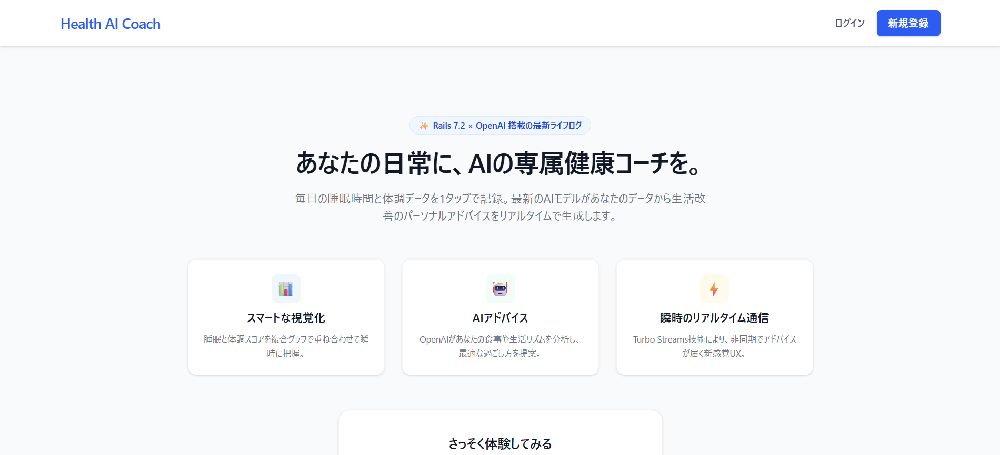
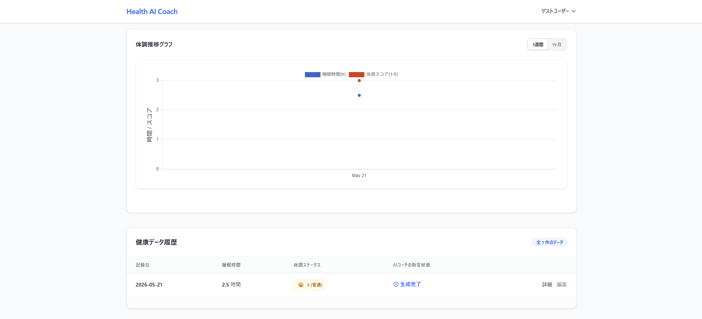
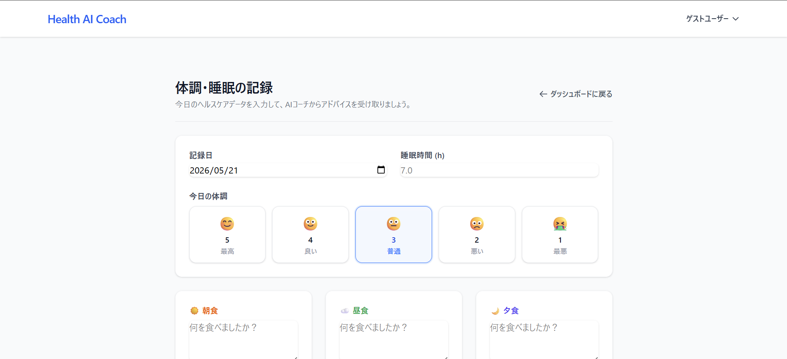
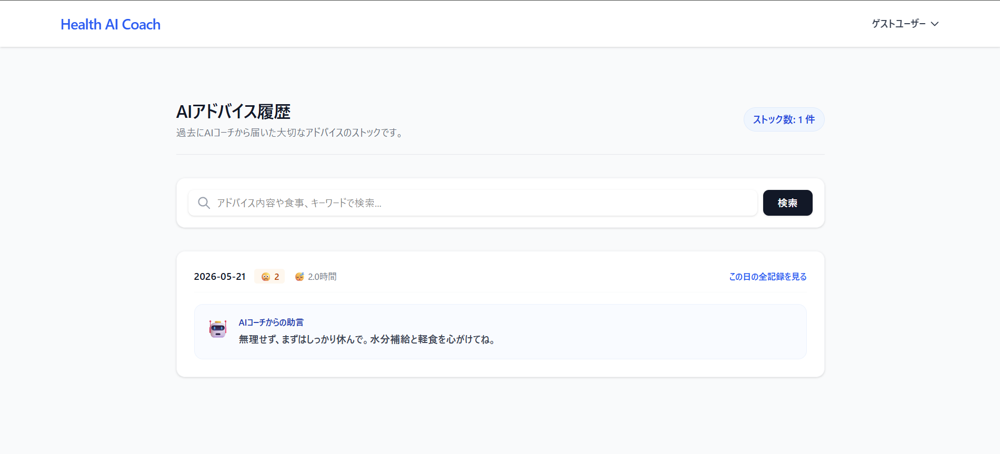

# Health AI Coach 📊🤖

## 📝 アプリの概要
### 「あなたの日常に、AIの専属健康コーチを。」
睡眠時間、体調スコア、そして3食の食事内容をサクッと記録するだけで、最新のAIモデルがあなたのライフログをリアルタイムで分析。明日をより良く過ごすためのパーソナルアドバイスを優しく提案してくれる、健康管理コーチングアプリケーションです。

---

## 🖼️ アプリのスクショ

| ログイン前（ランディングページ） | ログイン中（ダッシュボード） |
| --- | --- |
|  |  |

| 記録入力フォーム（5段階UI） | AIアドバイス履歴（マイページ） |
| --- | --- |
|  |  |

*※ `public/images/` ディレクトリの中にそれぞれのスクリーンショット画像を配置すると、ここに自動で表示されます。*

---

## 🚀 アプリの使い方（基本的な操作方法）

1. **1秒で体験（ゲストログイン）**
   トップ画面にあるエメラルドグリーンの「⚡ 登録不要でゲスト利用開始」ボタンを押すと、アカウント作成の手間なく瞬時にダッシュボードへログインできます。
2. **今日のヘルスケアデータを記録**
   「今日の体調を記録する」へ進み、直感的な5段階の絵文字ボタンから体調を選択、睡眠時間と食事内容（任意）を入力して保存します。
3. **AIアドバイスの受取と視覚化**
   保存ボタンを押すと即座にデータが可視化され、画面リロードなしでAIコーチからの的確な健康アドバイスがパッと画面に届きます。
4. **過去の助言の振り返り**
   ヘッダーメニューの「AIアドバイス履歴」から、過去にAIからもらったアドバイスをキーワードで瞬時に検索・振り返ることができます。

---

## 🎯 なぜこれを作ったか（開発の動機・背景）

現代社会において、体調不良や睡眠不足を感じていても「具体的に自分の生活リズムのどこに問題があるのか」を自分一人で客観的に分析し、改善し続けることは困難です。
また、従来の健康管理アプリは「記録をつけて終わり」のものが多く、ユーザーが途中で飽きてしまうという課題がありました。

そこで、**「記録をつける行為そのものが楽しくなり、即座にフィードバックが得られる体験」** を提供したいと考え、Hotwireによるシームレスな画面遷移とOpenAI APIを融合させた本アプリを開発しました。毎日の体調を点数化し、AIが寄り添うことで、ユーザーが主体的に健康維持を楽しめる世界を目指しています。

---

## 💡 工夫したところ（技術的なこだわりポイント）

1. **インフラの限界をハックする「超省メモリ（512MB）」設計**
   Renderの無料枠（512MB RAM）におけるメモリ枯渇（OOMクラッシュ）を防ぐため、重たい外部常駐ワーカーを完全排除。Pumaを最小構成（シングルモード・スレッド数1）に絞り込み、Active Jobを `inline`（その場実行）駆動にスイッチすることで、インフラコストを最小限に抑えつつ高速かつ安定した公開環境を達成しました。
2. **PostgreSQLの厳格な型制約を考慮したデータ移行**
   体調UIを文字列型（good/normal/bad）から5段階の数値（1〜5）へコンバートする際、本番 PostgreSQL の厳格な外部制約を突破するため、既存データを安全に整数へキャストする専用マイグレーション（`using: 'condition::integer'`）を自作し、データ整合性を完全に維持しました。
3. **Action Cable の本番環境最適化**
   本番環境で Action Cable が Redis アダプタを探しに行き `Gem::LoadError` で落ちるバグを回避するため、`cable.yml` の本番設定を `adapter: async`（メモリ共用型）へと適切にハック。無駄なアドオン契約を一切不要にしたスマートなリアルタイム通信を実現しました。
4. **ジェム非依存の「ピュアRailsページネーション」の構築**
   Kaminari等のジェムが内部発行するクエリが、Chartkick（Chart.js）の複雑な Mixed Chart（棒・折れ線の重なり順制御）のデータ配列と干渉しグラフを破壊するバグに直面。ジェムを完全にアンインストールし、Rubyの配列操作（`.drop` / `.take`）を用いた完全自作のページネーション関数を実装することで、グラフの描画崩れを100%防止しました。

---

## 📊 ER図（データベースの設計図）

アプリケーションは、ユーザーの認証情報を守る `User` モデルと、日々のデータを蓄積する `HealthRecord` モデルの「1対多（`has_many`）」のクリーンなリレーションで設計されています。

```text
+-----------------------+              +-----------------------+

|         users         |              |    health_records     |
+-----------------------+              +-----------------------+

| id (PK)         :int  |              | id (PK)         :int  |
| email           :str  |              | user_id (FK)    :int  | <--- (Dependent: :destroy)
| encrypted_pwd   :str  |              | recorded_on     :date |
| name            :str  |              | sleep_time      :float|
| target_sleep_min:float|              | condition       :int  | (1-5の整数型スコア)
| created_at      :time |              | breakfast_memo  :text |
| updated_at      :time |              | lunch_memo      :text |
+-----------------------+              | dinner_memo     :text |

                                       | ai_advice       :text |
                                       | created_at      :time |
                                       | updated_at      :time |
                                       +-----------------------+

【制約・インデックス】
- users.email: Uniqueness
- health_records.[user_id, recorded_on]: 複合Uniqueインデックス (1日1件制限の担保)
```

---

## 🛠️ 技術スタック
- **Language/Framework**: Ruby 3.3.4 / Ruby on Rails 7.2.2.1
- **Database**: PostgreSQL (Production) / SQLite3 (Development)
- **Frontend**: Tailwind CSS / Hotwire (Turbo / Stimulus) / Chartkick (Chart.js)
- **AI Integration**: OpenAI API (`ruby-openai` / `gpt-4o-mini`)
- **Infrastructure**: Render (Web / Free Database)
